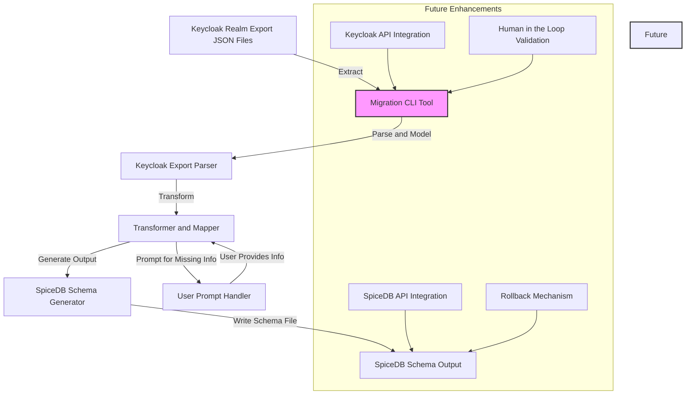

# Keycloak to SpiceDB Migration Tool - Architecture Report

## High-Level System Architecture

This migration tool automates the transformation of Keycloak realms into SpiceDB schemas.

### **Mermaid Diagram Representation**


## Data Flow Explanation  
1. **Input Extraction (Keycloak)**: The user provides a Keycloak realm export JSON file.  
2. **Parsing & Modeling**: The parser reads the export data and constructs an internal representation.  
3. **Transformation to SpiceDB Schema**: Keycloak concepts are mapped to SpiceDB constructs.  
4. **Handling Missing Information**: The CLI prompts the user for missing or ambiguous data.  
5. **Output Generation (SpiceDB Schema)**: A SpiceDB `.zed` schema is generated and saved.  
6. **Future Enhancements**:
   - **Keycloak API Integration**: Directly fetch realm data via Keycloak's Admin API.  
   - **SpiceDB API Integration**: Push schema changes directly to SpiceDB.  
   - **Human-in-the-Loop Validation**: Provide an approval step before applying schema changes.  
   - **Rollback Mechanism**: Implement the ability to revert schema changes if needed.  

## CLI User Experience
The CLI tool follows a simple command structure:
```bash
$ k2spicedb migrate --realm-export realm.json --out schema.zed -v
```
- If additional input is required, the tool will prompt the user interactively.  
- Logs will be output to stdout, with warnings and errors clearly indicated.  

## Future Work  
- Support for concurrent API calls for performance optimization.  
- Improved schema validation before exporting to SpiceDB.  
- Logging and monitoring enhancements.  

This tool aims to streamline the transition from Keycloak to SpiceDB, making the migration process efficient and user-friendly.
